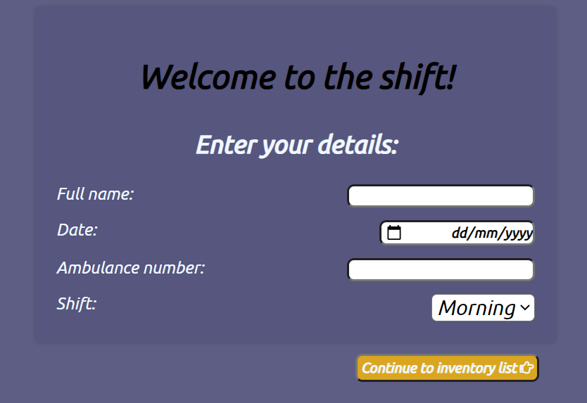
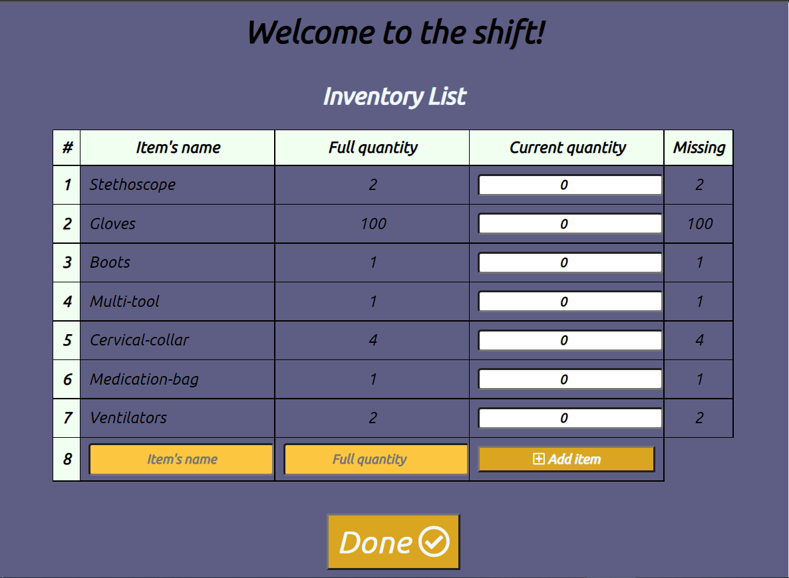
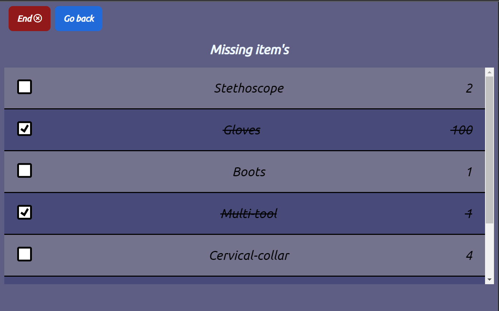
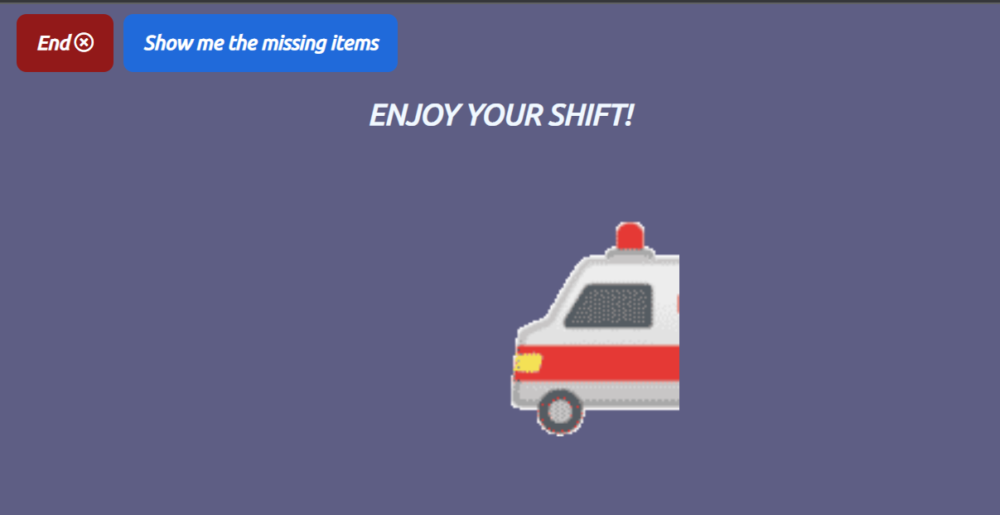

# State management week-end task - Paramedic equipment list

---

### Technologies in use - 👩‍💻👨‍💻

- **[React](https://reactjs.org/)**
- **[React Router DOM](https://www.npmjs.com/package/react-router-dom)**
- **[Redux](https://redux.js.org/)**

#### Packages

- **[Font-Awesone](https://fontawesome.com/) -For icons**
- **[React-toastify](https://fkhadra.github.io/react-toastify/introduction/) - for nice popUp messages**
- **[gh-pages](https://github.com/gitname/react-gh-pages) - For deployment**

---

## My app -

### Visit my app - ✨✨

### Login form - 🔑

- **An employee needs to enter his personal details**
- **An employee should enter the shift details in which he works - Date, ambulance number and shift time**

### Inventory check - 📃✔

#### There is a basic equipment list that contains:

- **Item's name And full quantity**
- **The employee must fill in how much he currently has in the column Current quantity**
- **The deficiencies are updated in relation to full quantity**

#### Add new item: ➕

- **If the item is not listed you can add it at the bottom of the table**
- **You can delete items you have added at the click of a button**

### End screen - 🚑

- **You can choose whether to end the process or move to the missing item's list**

### The missing items list- 📃❌

- **Only the missing items are displayed and how much is missing**
- **You can mark V on the items you have completed and they will be marked this way by a cross line**

---

## Screenshots 📸 -

### 

### 

### 

### 

---
